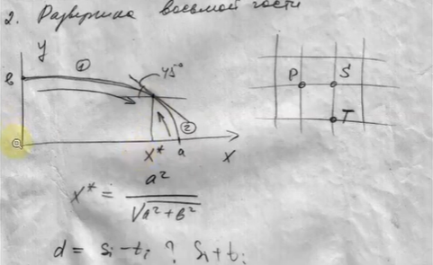
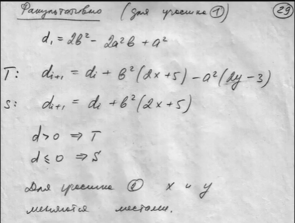
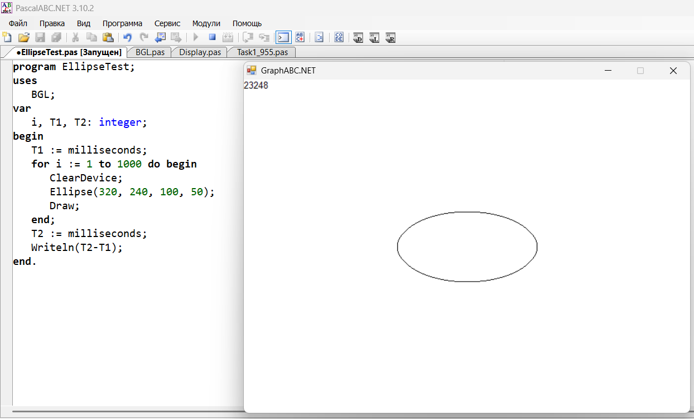
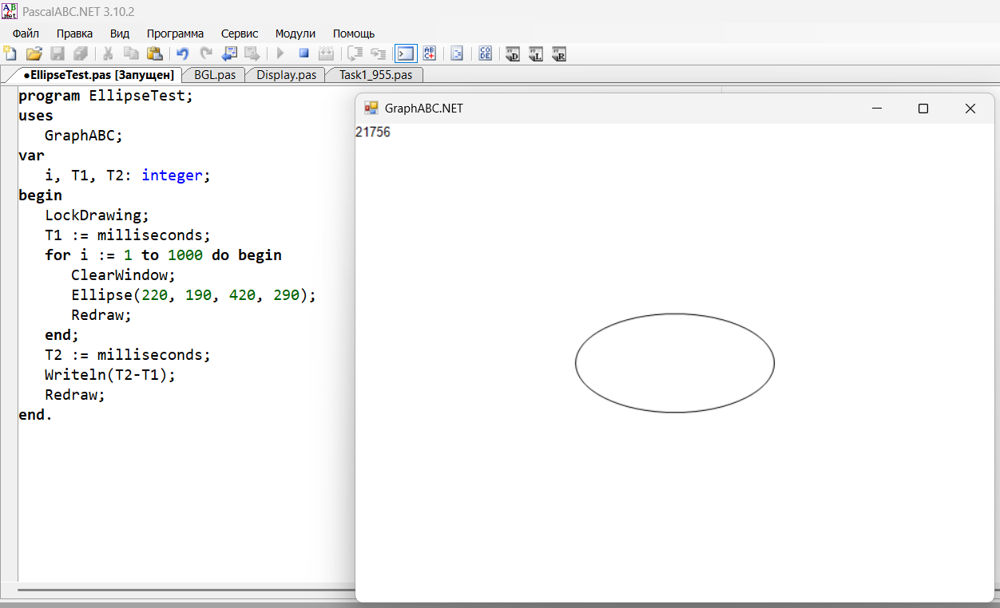

## Выкладки по формулам

## Сравнение
Сравнение будет проходить с аналогичной процедурой в GraphABC.
#### BGL:

Результаты тестов:
1) 23248
2) 23723
3) 24118
4) 23756
5) 20498
#### GraphABC:

Результаты тестов:
1) 21756
2) 23625
3) 23572
4) 23871
5) 24002